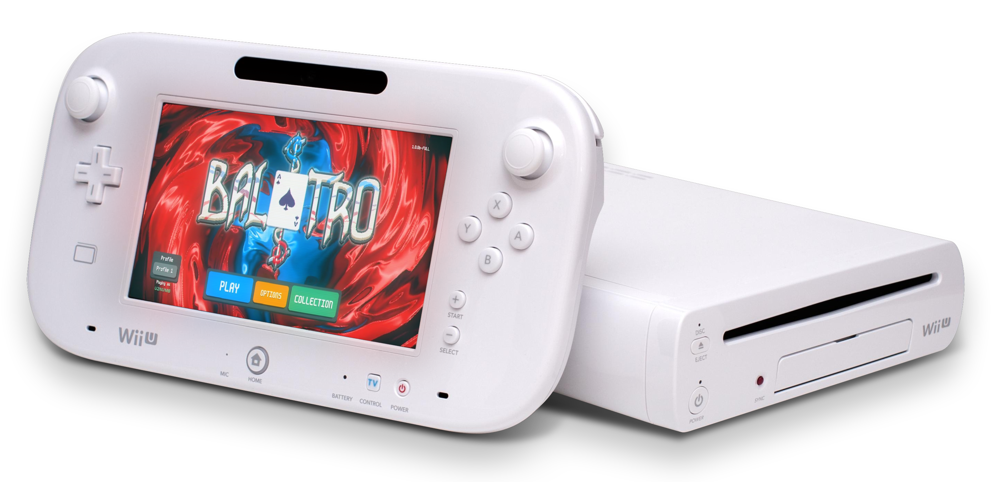

<p align="center">
 <h2 align="center">Balatro U</h2>
 <p align="center">Run Balatro on your modded Wii U!</p>
</p>
  <p align="center">
    <a href="https://github.com/xtomasnemec/Balatro-Wii-U/contributors">
      
    </a>
    <a href="https://github.com/xtomasnemec/Balatro-Wii-U/issues">
      
    </a>
    <a href="https://github.com/xtomasnemec/Balatro-Wii-U/pulls">
      
    </a>
    <br />
    <br />
  </p>



This is an unofficial port of **Balatro** for the Wii U (Aroma) using my [custom LovePotion fork](https://github.com/xtomasnemec/lovepotion/tree/3.1.0-development).

<p align="left">
    <a href="https://github.com/xtomasnemec/lovepotion/contributors">
      
    </a>
    <a href="https://github.com/xtomasnemec/lovepotion/issues">
      
    </a>
    <a href="https://github.com/xtomasnemec/lovepotion/pulls">
      
    </a>
    <br />
    <br />
  </p>

---

> [!WARNING]  
> The game is still in development, see [#2](https://github.com/xtomasnemec/Balatro-Wii-U/issues/2)


## Features
- Runs natively on Wii U via Aroma
- Based on the official Steam version of Balatro
- Easy automated build process (Windows)

---

## Requirements
- A Wii U modded with Aroma and a PC duh
- Windows 10/11/Linux (WIP)/macOS (WIP)
- Your PC has to supported by Docker (except for Linux or when using a precompiled binary)
> - CPU requirements should meet a minimum clock speed of 2.4 GHz
> - The CPU architecture must support 64-bit computing
> - Virtual cores must be mapped 1:1 to a CPU hyper-thread (If a Docker host is being deployed on hypervisor)
> - Network requirements dictate a minimum port speed of 100 Mbps (1Gbps/sec is recommended)
- A legal *wink wink* (>ᴗ•) copy of **Balatro** (Steam version)

---

## Quick Start (Windows)
1. **Clone this repository**
2. **Run** `build.bat`
3. **Select** option `1` to install dependencies
   - _Note: You may need to set up Docker manually if not already installed_
4. **Select** option `2` to extract game files
   - Place your `Balatro.exe` (Steam version) in the repo folder, or ensure it is installed via Steam
5. **Select** option `3` and then `1` to build the game _(this may take a while)_
> [!NOTE] 
> If your PC can't run docker use option `3` and then `2` (the precompiled binary is downloaded from [here](https://github.com/xtomasnemec/Balatro-U-precompiled/tree/main))
6. **Select** option `4` to clean up build files (optional)
7. **Copy** the contents of the `to sdcard` folder to your SD card
8. **Insert SD card** into your Wii U and launch the game from the home menu
9.  **Profit**
10. **???**

---

## Quick Start (Linux)
1. Run this in terminal
```
curl -sSL https://raw.githubusercontent.com/xtomasnemec/Balatro-Wii-U/main/install.sh | sudo bash
sudo ./Balatro-Wii-U/build.sh
```
2. Place your `Balatro.exe` (Steam version) in the repo folder
3. **Copy** the contents of the `to sdcard` folder to your SD card
4. **Insert SD card** into your Wii U and launch the game from the home menu
5. **Profit**
6.  **???**
---
## Quick Start (macOS)
- TODO
---

## Troubleshooting
- **Hash mismatch?**
  - Only the official Steam version (1.0.1o-Full) of Balatro is tested.
- **Missing dependencies?**
  - Use option 1 in `build.bat` to install those dependencies automatically.
- **Build fails or is slow?**
  - Building can take a long time, even my PC takes 3 minutes to build.
- **Docker is not supported on my PC**
  - Try compiling it in Linux (when the Linux support is done)
  - Or compile it at your friend's house ¯\\_\(ツ)\_/¯
---

## Credits
- Banner and icons: [Rodrick_](https://github.com/rodrickhmmm)
- Original game: [LocalThunk](https://localthunk.com/) (pls don't sue me)
- [devkitPro](https://devkitpro.org/)
- [LovePotion](https://lovebrew.org/)
- [CafeGLSL](https://github.com/Exzap/CafeGLSL)
